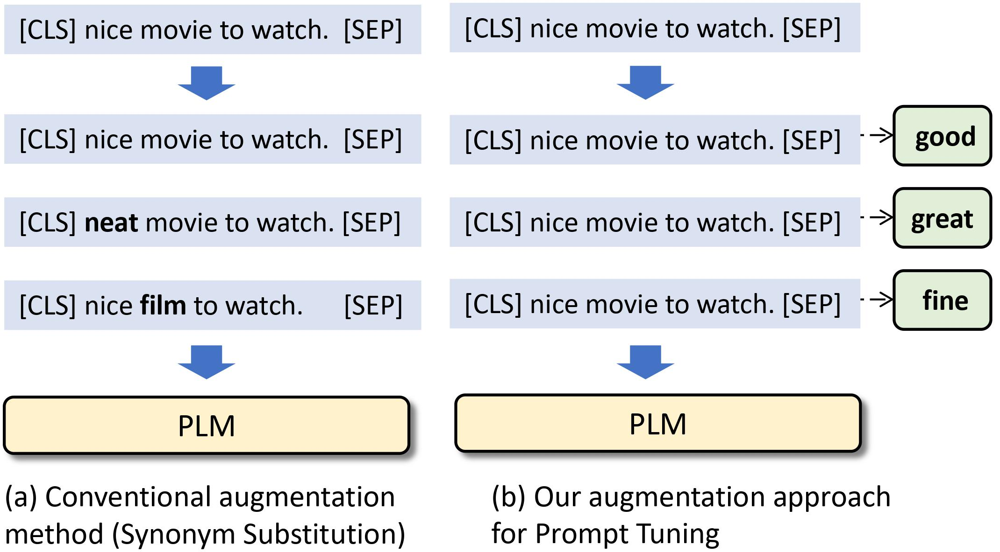

# PromptDA: Label-guided Data Augmentation for Prompt-based Few-Shot Learners
**Canyu Chen**, Kai Shu

The code for **[PromptDA: Label-guided Data Augmentation for Prompt-based Few-Shot Learners](https://arxiv.org/abs/2205.09229)**, which has been accepted to *Proceedings of the 17th Conference of the European Chapter of the Association for Computational Linguistics* (**EACL 2023**). [paper](https://arxiv.org/abs/2205.09229)


## Basic Idea
    

The basic comparison of conventional data augmentation methods **Synonym Substitution** and our proposed augmentation framework **PromptDA**. `good, great, fine` are the label words for prompt tuning. Conventional DA constructs *`instances`* for augmentation, but PromptDA constructs *`instance-label pairs`* for augmentation.


## Framework
    

The proposed **PromptDA** for few-shot learning (with sentiment classification task as an example): (a) **Label Augmentation**: deriving multiple label words for each class to enrich the label semantic space; (b) **Augmented Prompt-based Tuning**: training with the augmented instance-label pairs via masked language modeling; (c) **Prediction Transformation**:  aggregating  the probability scores on the derived label words for the final prediction. 

## Quick Start

First, download our repo:
```bash
git clone https://github.com/canyuchen/PromptDA.git
cd PromptDA
```
Reproduce the results for standard prompt tuning with template:
```bash
cd test_standard_with_template
sh test.sh
```
Reproduce the results for prompt tuning + PromptDA with manual label augmentation:
```bash
cd test_promptda_template_manual
sh test.sh
```
Reproduce the results for prompt tuning + PromptDA with automatic label augmentation:
```bash
cd test_promptda_template
sh test.sh
```
It is worth noting that the results of my training process on `CoLA`, `CR`, `MR`, `MPQA`, `SST-2`, `SST-5`, `SUBJ` datasets are recorded in the `*.log` files in `test_promptda_template/test_*`, `test_promptda_template_manual/test_*`, and `test_promptda_template/test_*`.


## Label Augmentation
Reproduce automatic label augmentation:
```bash
cd LM-BFF/tools
sh run_generate_labels.sh
```
It is worth noting that the results of our automatic label augmentation on `CoLA`, `CR`, `MR`, `MPQA`, `SST-2`, `SST-5`, `SUBJ` datasets are recorded in the files in `LM-BFF/my_auto_label_mapping/manual_template`.


## Citation
If you find our code useful, we will greatly appreacite it if you could consider citing our paper:
```
@article{chen2022promptda,
  title   = {PromptDA: Label-guided Data Augmentation for Prompt-based Few Shot Learners},
  author  = {Canyu Chen and Kai Shu},
  year    = {2022},
  journal = {arXiv preprint arXiv: Arxiv-2205.09229}
}
```

## Acknowledgement

Our Label Augmentation method is modified based on the code of Making Pre-trained Language Models Better Few-shot Learners ([LM-BFF](https://github.com/princeton-nlp/LM-BFF), ACL 2021). Thanks to the authors!


