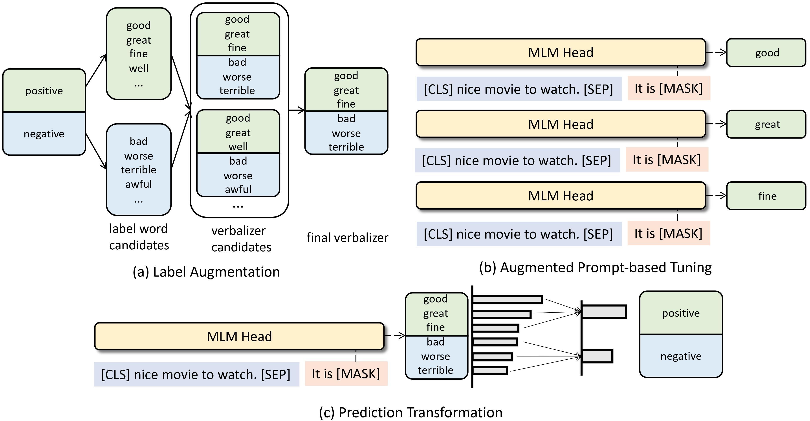

# PromptDA: Label-guided Data Augmentation for Prompt-based Few-Shot Learners
**Canyu Chen**, Kai Shu

The code for **PromptDA: Label-guided Data Augmentation for Prompt-based Few-Shot Learners**, which has been accepted to **EACL 2023**. [paper](https://arxiv.org/abs/2205.09229)

# Basic Idea
    

The basic comparison of conventional data augmentation methods **Synonym Substitution** and our proposed augmentation framework **PromptDA**. `good, great, fine` are the label words for prompt tuning. Conventional DA constructs *`instances`* for augmentation, but PromptDA constructs *`instance-label pairs`* for augmentation.

# Framework
    

The proposed **PromptDA** for few-shot learning (with sentiment classification task as an example): (a) **Label Augmentation**: deriving multiple label words for each class to enrich the label semantic space; (b) **Augmented Prompt-based Tuning**: training with the augmented instance-label pairs via masked language modeling; (c) **Prediction Transformation**:  aggregating  the probability scores on the derived label words for the final prediction. 

